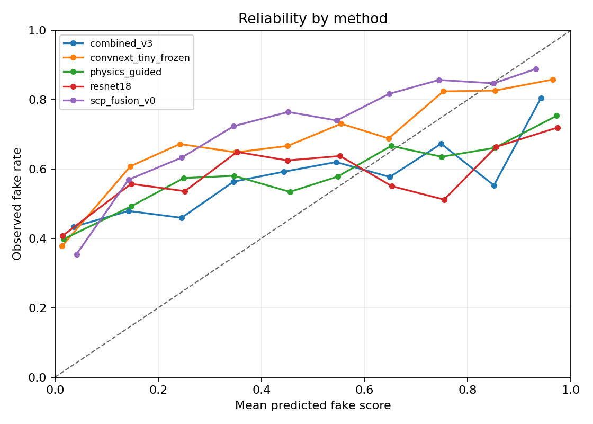

# Calibration Diagnostics

Run date: 2026-06-12

This follow-up adds probability-calibration metrics to the Ishu-to-MS-COCOAI cross-domain comparison. Earlier reports showed that SCP-Fusion v0 has the best target-domain AUC but weaker default-threshold accuracy. This report asks a sharper question: do the model scores behave like probabilities after crossing datasets?

Implementation:

- `src/forensic_compare/metrics.py`
  - Brier score;
  - expected calibration error;
  - maximum calibration error;
  - equal-width reliability bins.
- `scripts/summarize_calibration_metrics.py`
  - consumes saved `predictions.csv` files;
  - writes per-run metrics, method means, reliability-bin CSVs, and a reliability plot.

## Ishu to MS COCOAI Summary

The table averages seeds 7, 17, and 29 on the source-balanced MS COCOAI target split. Lower Brier score and ECE are better. AUC is still included because it measures ranking separately from probability calibration.

| method | accuracy | AUC | Brier score | ECE | max calibration error | predicted fake rate |
| --- | ---: | ---: | ---: | ---: | ---: | ---: |
| `combined_v3` | 0.5467 | 0.5803 | 0.3417 | 0.2911 | 0.3975 | 0.1740 |
| SCP-Fusion v0 | 0.5910 | 0.7282 | 0.3190 | 0.3087 | 0.4806 | 0.1383 |
| physics-guided fusion | 0.6060 | 0.6637 | 0.3367 | 0.3094 | 0.4021 | 0.2707 |
| frozen ConvNeXt-Tiny | 0.6163 | 0.7139 | 0.3302 | 0.3185 | 0.4598 | 0.1870 |
| ResNet-18 | 0.5800 | 0.6488 | 0.3549 | 0.3353 | 0.4357 | 0.2453 |



## Interpretation

SCP-Fusion v0 now has the best cross-domain Brier score and AUC. That is useful: the fused score is better than either branch family at ranking the target images and has the lowest mean squared probability error. It is not yet well calibrated in the reliability-curve sense, because its ECE is slightly worse than `combined_v3` and close to physics-guided fusion.

The predicted fake-rate column explains the default-threshold weakness. The target split is balanced, but SCP-Fusion v0 only calls 13.8% of images fake at threshold 0.5. Frozen ConvNeXt is also conservative at 18.7%. Physics-guided fusion calls more images fake, 27.1%, which helps thresholded accuracy even though its AUC and Brier score trail SCP-Fusion.

This gives the paper a cleaner calibration story:

- AUC: SCP-Fusion v0 is strongest.
- Brier score: SCP-Fusion v0 is strongest.
- ECE: no method is good; `combined_v3` has the lowest mean ECE mostly because its scores are compressed and weakly ranked.
- Default decision threshold: all strong ranking methods are under-calling generated MS COCOAI images after training on Ishu.

For WIFS and DFF, this supports framing calibration as a first-class contribution rather than a footnote. The next SCP-Fusion version should not simply add another branch; it should add a source-aware calibration head or a post-hoc calibration step trained on source-heldout validation.

## Reproduce

```powershell
python scripts/summarize_calibration_metrics.py `
  --out-dir runs\calibration_diagnostics\ishu_to_ms_cocoai_all4 `
  --n-bins 10 `
  --predictions seed7:combined_v3=runs\ishu_to_ms_cocoai_source_balanced_seed7\combined_v3\predictions.csv `
  --predictions seed7:resnet18=runs\ishu_to_ms_cocoai_source_balanced_seed7\resnet18\predictions.csv `
  --predictions seed7:physics_guided=runs\ishu_to_ms_cocoai_source_balanced_seed7\physics_guided_resnet18_combined_v3\predictions.csv `
  --predictions seed7:convnext_tiny_frozen=runs\ishu_to_ms_cocoai_source_balanced_seed7\convnext_tiny_frozen\predictions.csv `
  --predictions seed7:scp_fusion_v0=runs\score_fusion\ishu_seed7_to_ms_cocoai_all4\ms_cocoai\predictions.csv `
  --predictions seed17:combined_v3=runs\ishu_to_ms_cocoai_source_balanced_seed17\combined_v3\predictions.csv `
  --predictions seed17:resnet18=runs\ishu_to_ms_cocoai_source_balanced_seed17\resnet18\predictions.csv `
  --predictions seed17:physics_guided=runs\ishu_to_ms_cocoai_source_balanced_seed17\physics_guided_resnet18_combined_v3\predictions.csv `
  --predictions seed17:convnext_tiny_frozen=runs\ishu_to_ms_cocoai_source_balanced_seed17\convnext_tiny_frozen\predictions.csv `
  --predictions seed17:scp_fusion_v0=runs\score_fusion\ishu_seed17_to_ms_cocoai_all4\ms_cocoai\predictions.csv `
  --predictions seed29:combined_v3=runs\ishu_to_ms_cocoai_source_balanced_seed29\combined_v3\predictions.csv `
  --predictions seed29:resnet18=runs\ishu_to_ms_cocoai_source_balanced_seed29\resnet18\predictions.csv `
  --predictions seed29:physics_guided=runs\ishu_to_ms_cocoai_source_balanced_seed29\physics_guided_resnet18_combined_v3\predictions.csv `
  --predictions seed29:convnext_tiny_frozen=runs\ishu_to_ms_cocoai_source_balanced_seed29\convnext_tiny_frozen\predictions.csv `
  --predictions seed29:scp_fusion_v0=runs\score_fusion\ishu_seed29_to_ms_cocoai_all4\ms_cocoai\predictions.csv
```
