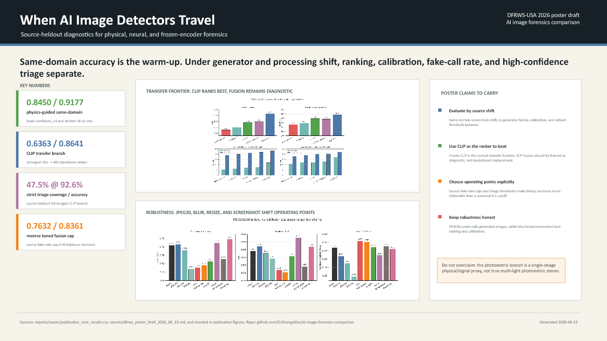

# DFRWS Poster Draft

Run date: 2026-06-13

This is the first editable one-slide DFRWS poster draft generated from the checked-in poster brief and publication figures.

## Files

| artifact | path |
| --- | --- |
| editable PowerPoint draft | `reports/assets/dfrws_poster_draft_2026_06_13.pptx` |
| rendered PNG preview | `reports/assets/dfrws_poster_draft_2026_06_13.png` |
| source brief | `reports/dfrws_poster_brief_2026_06_13.md` |
| key numbers | `reports/assets/dfrws_poster_key_numbers.csv` |
| poster-native figure pack | `reports/dfrws_poster_native_figures_2026_06_13.md` |
| updated v2 draft | `reports/dfrws_poster_draft_v2_2026_06_13.md` |

## Poster Claim

Same-domain accuracy is only the warm-up. Under generator and processing shift, ranking, calibration, fake-call rate, and high-confidence triage separate.

## What The Draft Shows

- Physics-guided fusion improves the same-domain Ishu anchor over both `combined_v3` and ResNet-18.
- Frozen CLIP is the current transfer-ranking and high-confidence triage frontier.
- SCP-Fusion is framed as a diagnostic protocol rather than a claim that fusion beats CLIP everywhere.
- Transform robustness is intentionally caveated: JPEG30, blur, resize, and screenshot-style processing expose weaknesses.

## QA

- Exported with artifact-tool presentation JSX as an editable PPTX.
- Rendered preview inspected visually.
- Layout quality check passed with 0 errors and 0 warnings.
- PPTX package check confirms one slide.

## Next Edit

This v1 draft has been superseded by `reports/dfrws_poster_draft_v2_2026_06_13.md`, which uses the poster-native transfer and robustness panels from `reports/dfrws_poster_native_figures_2026_06_13.md`.
