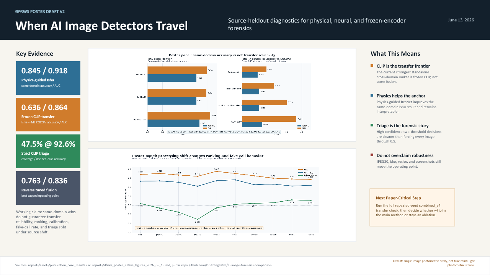

# DFRWS Poster Draft V2

Run date: 2026-06-13

This is the second editable one-slide DFRWS poster draft. It replaces the dense paper-figure layout from v1 with the new poster-native transfer and robustness panels.

## Files

| artifact | path |
| --- | --- |
| editable PowerPoint draft | `reports/assets/dfrws_poster_draft_v2_2026_06_13.pptx` |
| rendered PNG preview | `reports/assets/dfrws_poster_draft_v2_2026_06_13.png` |
| poster-native figure pack | `reports/dfrws_poster_native_figures_2026_06_13.md` |
| transfer panel source table | `reports/assets/dfrws_poster_transfer_panel.csv` |
| robustness panel source table | `reports/assets/dfrws_poster_robustness_panel.csv` |

## What Changed From V1

- Uses the DFRWS-specific transfer and robustness panels instead of denser publication figures.
- Keeps a left metric rail for the four headline numbers.
- Keeps the right rail focused on interpretation and overclaim control.
- Makes the next paper-critical gap explicit: full repeated-seed `combined_v4` transfer.

## QA

- Exported with artifact-tool presentation workflow.
- Rendered preview inspected visually.
- Layout quality check passed with 0 errors and 0 warnings.
- PPTX package check: 1 slide, 2 media files, non-empty output.

## Remaining Poster Edit

The v2 deck is stronger for DFRWS than v1, but the embedded poster panels are still raster images inside the PowerPoint. The checked-in SVG and CSV panel sources remain available for a future fully editable chart rebuild if the final poster format demands it.
