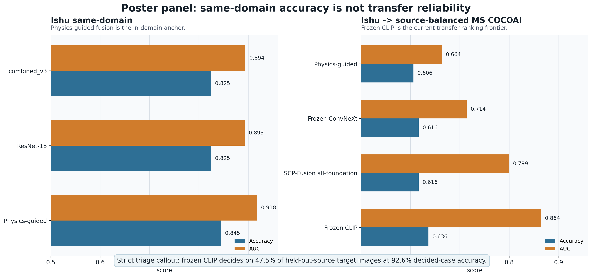
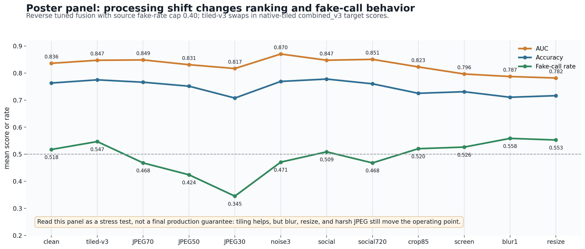

# DFRWS Poster-Native Figure Pack

Run date: 2026-06-13

Generated by `scripts/build_dfrws_poster_figures.py` from `reports/assets/publication_core_results.csv`.

These panels are intentionally simpler than the paper figures: large labels, few metrics, and SVG exports with live text for poster editing.

## Files

| panel | PNG | SVG | CSV |
| --- | --- | --- | --- |
| transfer headline | `reports/assets/dfrws_poster_transfer_panel.png` | `reports/assets/dfrws_poster_transfer_panel.svg` | `reports/assets/dfrws_poster_transfer_panel.csv` |
| robustness stress | `reports/assets/dfrws_poster_robustness_panel.png` | `reports/assets/dfrws_poster_robustness_panel.svg` | `reports/assets/dfrws_poster_robustness_panel.csv` |

## Transfer Panel

This panel keeps the poster claim crisp: physics-guided fusion improves the same-domain anchor, but frozen CLIP is the cross-domain ranking and strict-triage frontier.

## Robustness Panel

This panel makes the caveat visible: source-capped reverse fusion improves slightly when the conventional branch is native-tiled, but blur, resize, screenshots, and harsh recompression still shift ranking and fake-call behavior.

## Suggested Poster Swap

Replace the two dense embedded figures in the first poster draft with these two poster-native panels, then keep the older paper figures in the appendix/report package.
