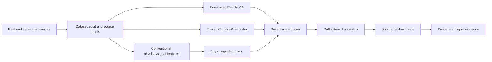
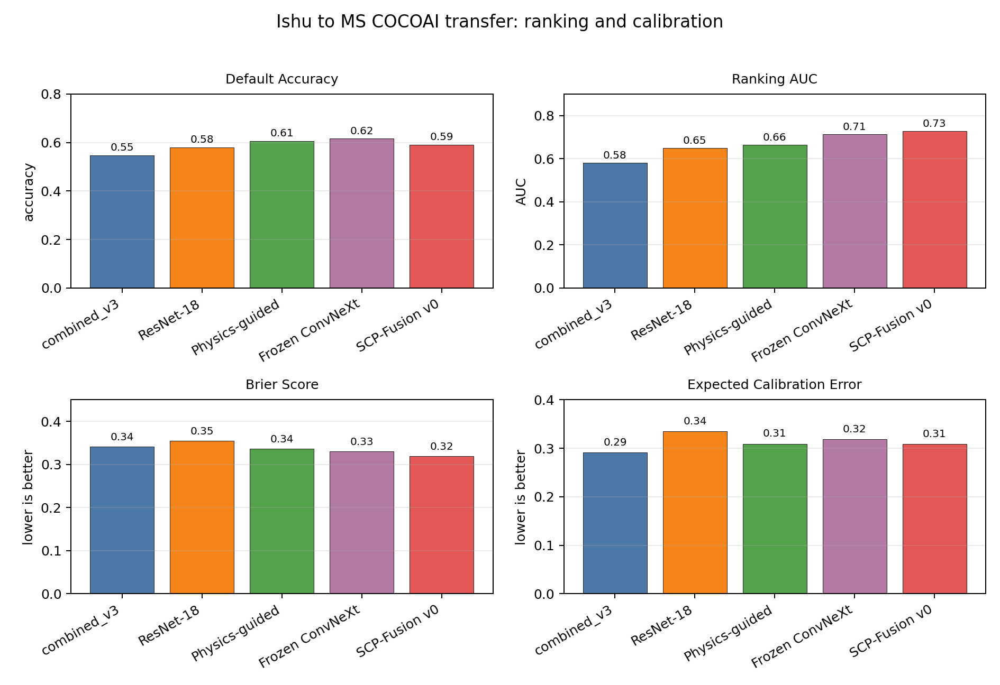
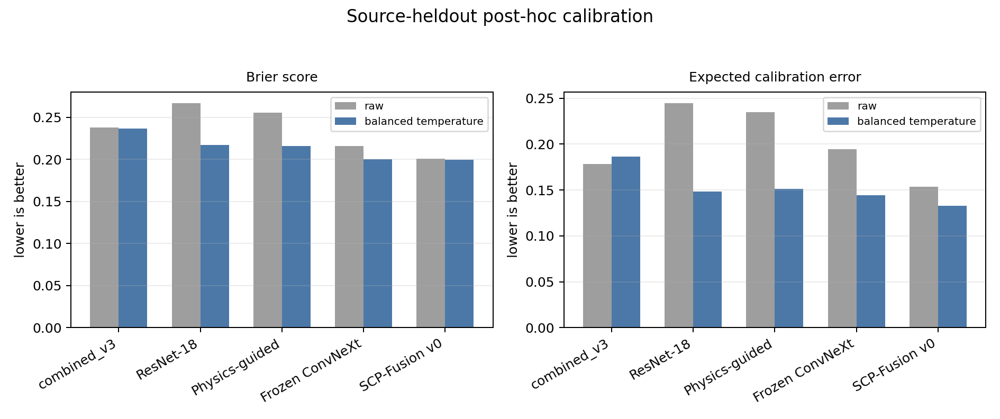
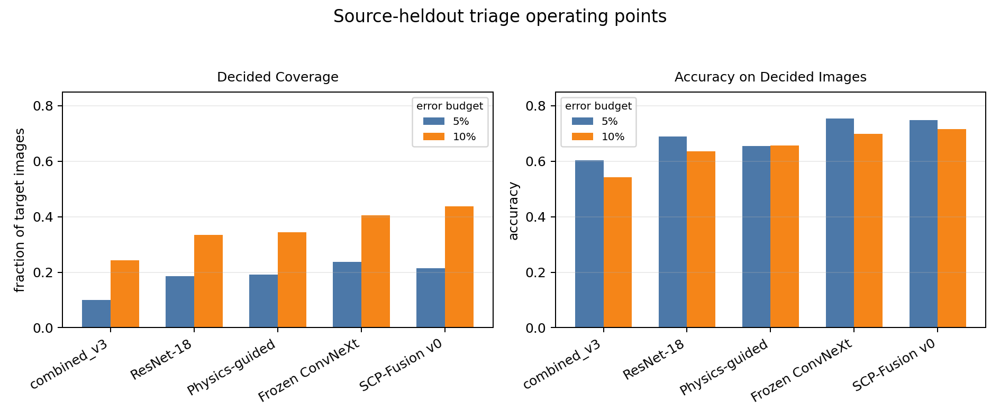
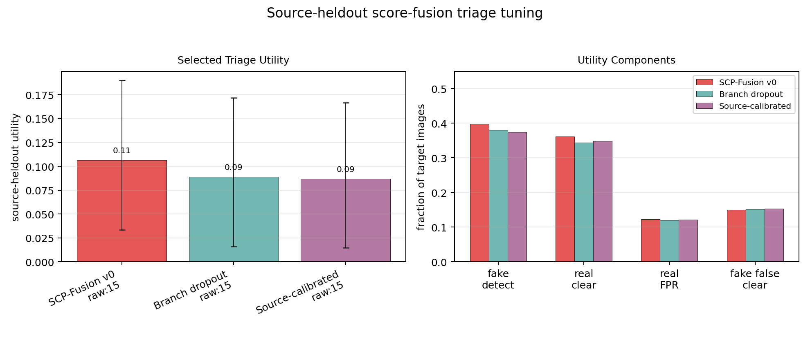
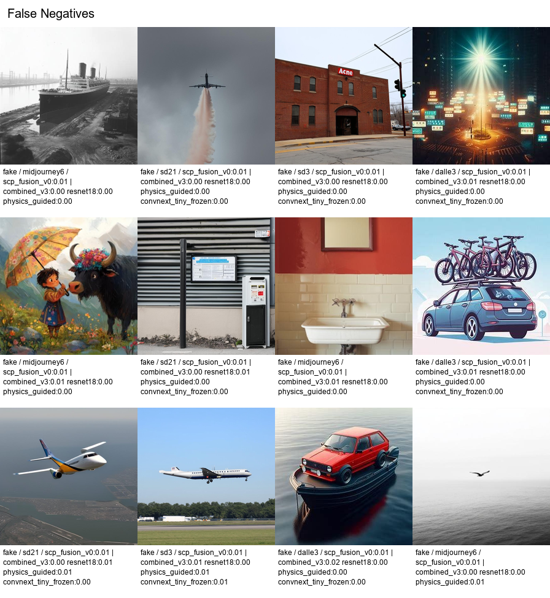

# Publication Assets

Run date: 2026-06-12

This report collects the first paper/poster-ready figures for DFRWS-USA 2026, IEEE WIFS 2026, and DFF-2026. The figures are generated by `scripts/build_publication_assets.py` from checked-in summary CSVs under `reports/assets/`.

## Pipeline Figure



## Figure 1: Transfer Ranking and Calibration



Caption draft:

Ishu-to-MS-COCOAI transfer shows that stronger ranking and calibrated probability quality do not necessarily align with default-threshold accuracy. Frozen ConvNeXt has the best default accuracy, while SCP-Fusion v0 has the best AUC and Brier score. This motivates reporting ranking, calibration, and thresholded decisions separately.

## Figure 2: Source-Heldout Post-Hoc Calibration



Caption draft:

Class-balanced temperature scaling improves source-heldout Brier score and expected calibration error for neural and fusion models without changing rank order or default decisions. Flexible Platt and isotonic calibrators are reported separately because they often overfit non-heldout source priors and inflate real-image false positives.

## Figure 3: Source-Heldout Triage



Caption draft:

Two-threshold triage trades coverage for reliability under generator shift. With a strict 5% calibration error budget, frozen ConvNeXt and SCP-Fusion make high-confidence decisions on about 21-24% of target images with roughly 75% triage accuracy. Relaxing the budget to 10% increases coverage but also increases held-out error.

## Figure 4: Utility-Tuned Score-Fusion Triage



Caption draft:

Source-heldout triage tuning separates probability calibration from high-confidence forensic utility. SCP-Fusion v0 has the best mean utility after selecting score mode and asymmetric triage budgets on non-heldout generators, while raw scores are selected for every held-out fold. The bootstrap intervals remain wide, so this should be framed as operating-point evidence rather than a decisive model ranking.

## Figure 5: Qualitative Failure Cases



Caption draft:

Generated MS COCOAI images missed by SCP-Fusion v0 in the seed-17 transfer run. Several examples receive near-zero fake scores from all compared branches, showing that cross-source failure is not merely a threshold-calibration problem. Additional false-positive and disagreement grids are in `reports/qualitative_failure_cases_2026_06_12.md`.

## DFRWS Poster Abstract Draft

AI-generated image detectors often look strong when trained and tested on the same dataset, but their reliability drops when the generator family, image source, or post-processing pipeline changes. This project evaluates real-vs-generated image detection as a source-heldout forensic problem rather than a closed-set classification task. We compare handcrafted physical/signal features, fine-tuned ResNet-18, a physics-guided neural fusion model, a frozen ConvNeXt encoder, and a lightweight saved-score fusion model named SCP-Fusion v0. The benchmark includes same-domain repeated-seed runs, cross-dataset transfer from Ishu AI-vs-real images to a source-balanced Defactify/MS COCOAI split, robustness transforms, source-heldout calibration diagnostics, and two-threshold forensic triage.

The results show a consistent gap between ranking, calibration, and binary decision quality. SCP-Fusion v0 improves cross-domain AUC to 0.7282 and has the best Brier score among the compared methods, while frozen ConvNeXt provides the strongest default-threshold accuracy on the target split. However, all strong ranking models under-call generated images at a fixed 0.5 threshold. Source-heldout calibration shows that class-balanced temperature scaling improves Brier score and expected calibration error, but does not solve held-out fake recall. A practical triage mode gives investigators a more conservative workflow: at a strict 5% calibration error budget, frozen ConvNeXt and SCP-Fusion make high-confidence decisions on about one quarter of target images with roughly 75% accuracy on decided cases. A utility-tuned score-fusion follow-up further shows that probability calibration and high-confidence triage utility can prefer different score geometry. These findings support source-aware evaluation and calibrated triage as practical requirements for AI-image forensics.

## Rebuild Command

```powershell
python scripts/build_publication_assets.py --out-dir reports\assets
```

Generated files:

- `reports\assets\publication_cross_domain_calibration.png`
- `reports\assets\publication_source_heldout_calibration.png`
- `reports\assets\publication_triage_operating_points.png`
- `reports\assets\publication_score_fusion_tuned_triage.png`
- `reports\assets\qualitative_seed17_scp_fusion_false_negatives.png`
