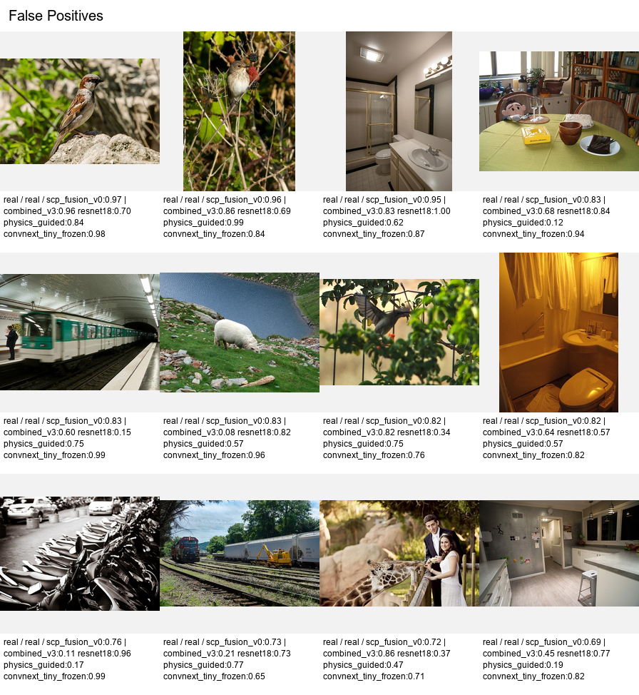
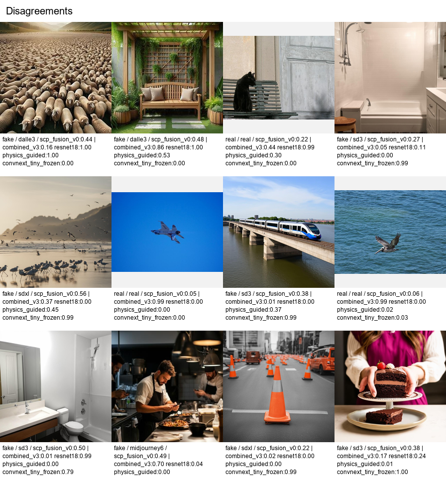

# Qualitative Failure Cases

Run date: 2026-06-12

This report adds DFF-ready qualitative examples for the Ishu-to-MS-COCOAI transfer setting. The grids are generated by `scripts/export_failure_case_grids.py` from saved prediction CSVs plus the source-balanced MS COCOAI metadata. SCP-Fusion v0 is used as the primary method, and each caption includes scores from:

- `combined_v3`
- ResNet-18
- physics-guided fusion
- frozen ConvNeXt-Tiny
- SCP-Fusion v0

The examples come from the seed-17 transfer run because earlier diagnostics identified it as a useful failure case for model generalization.

## False Positives



Caption draft:

Real MS COCO images that SCP-Fusion v0 scores as generated. Several false positives are natural scenes with strong texture regularity, lighting constraints, or object/category biases, such as birds, bathrooms, transit imagery, and indoor scenes. These examples are useful for explaining why detector score geometry can drift under dataset shift.

## False Negatives


Caption draft:

Generated MS COCOAI images missed by SCP-Fusion v0. Many are not just ambiguous; several receive near-zero fake scores from every branch. This supports the paper's calibration argument: the detector is not only mis-thresholded, it can be confidently wrong on held-out generators and scene families.

## Model Disagreements



Caption draft:

High-disagreement examples across conventional features, ResNet-18, physics-guided fusion, frozen ConvNeXt, and SCP-Fusion v0. These cases show that the branches capture different artifacts: some images are flagged strongly by ResNet or ConvNeXt while conventional/physics scores remain low, and vice versa. This motivates fusion and source-aware calibration rather than relying on a single detector family.

## Reproduce

```powershell
python scripts/export_failure_case_grids.py `
  --metadata data\raw\ms_cocoai_2026_validation_source_balanced_100\metadata.csv `
  --out-dir runs\failure_cases\ishu_seed17_to_ms_cocoai_all4 `
  --split validation `
  --primary-method scp_fusion_v0 `
  --threshold 0.5 `
  --top-k 12 `
  --tile-size 224 `
  --columns 4 `
  --min-disagreement 0.55 `
  --predictions combined_v3=runs\ishu_to_ms_cocoai_source_balanced_seed17\combined_v3\predictions.csv `
  --predictions resnet18=runs\ishu_to_ms_cocoai_source_balanced_seed17\resnet18\predictions.csv `
  --predictions physics_guided=runs\ishu_to_ms_cocoai_source_balanced_seed17\physics_guided_resnet18_combined_v3\predictions.csv `
  --predictions convnext_tiny_frozen=runs\ishu_to_ms_cocoai_source_balanced_seed17\convnext_tiny_frozen\predictions.csv `
  --predictions scp_fusion_v0=runs\score_fusion\ishu_seed17_to_ms_cocoai_all4\ms_cocoai\predictions.csv
```

Checked-in assets:

- `reports\assets\qualitative_seed17_scp_fusion_false_positives.png`
- `reports\assets\qualitative_seed17_scp_fusion_false_negatives.png`
- `reports\assets\qualitative_seed17_scp_fusion_disagreements.png`
- `reports\assets\qualitative_seed17_scp_fusion_false_positives.csv`
- `reports\assets\qualitative_seed17_scp_fusion_false_negatives.csv`
- `reports\assets\qualitative_seed17_scp_fusion_disagreements.csv`
