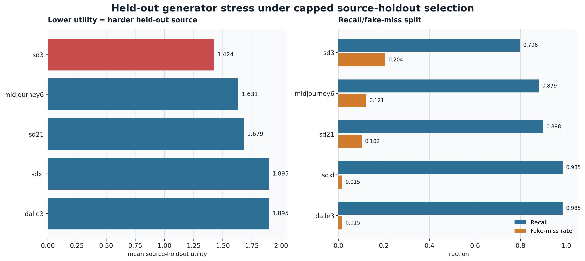

# Source-Holdout Generator Stress Figure

Run date: 2026-06-14

Generated by `scripts/build_source_stress_figure.py` from the selected source-holdout policy summary.

For the paper-facing `source_holdout_mean_utility_cap_0p48` policy, the weakest held-out generator is `sd3` with mean utility 1.4235, mean recall 0.7961, and mean fake-miss rate 0.2039.

## Source Stress Table

| selection_policy | heldout_source_name | source_holdout_utility_mean | source_holdout_recall_mean | source_holdout_fake_miss_rate_mean | source_holdout_predicted_positive_rate_mean |
| --- | --- | --- | --- | --- | --- |
| source_holdout_mean_utility_cap_0p48 | sd3 | 1.4235 | 0.7961 | 0.2039 | 0.1325 |
| source_holdout_mean_utility_cap_0p48 | midjourney6 | 1.6315 | 0.8793 | 0.1207 | 0.1551 |
| source_holdout_mean_utility_cap_0p48 | sd21 | 1.6787 | 0.8981 | 0.1019 | 0.1721 |
| source_holdout_mean_utility_cap_0p48 | sdxl | 1.8955 | 0.9848 | 0.0152 | 0.1818 |
| source_holdout_mean_utility_cap_0p48 | dalle3 | 1.8955 | 0.9848 | 0.0152 | 0.1690 |

## Files

| asset | path |
| --- | --- |
| PNG | `reports/assets/source_holdout_generator_stress.png` |
| SVG | `reports/assets/source_holdout_generator_stress.svg` |
| CSV | `reports/assets/source_holdout_generator_stress.csv` |
